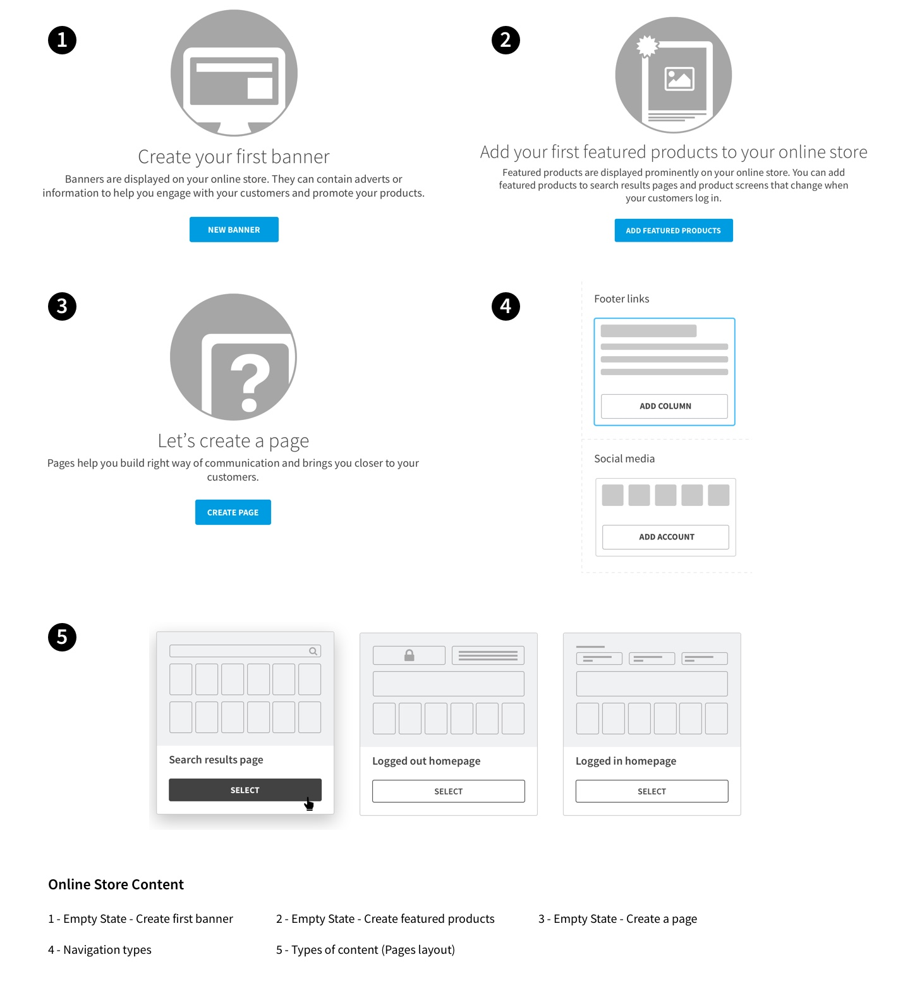
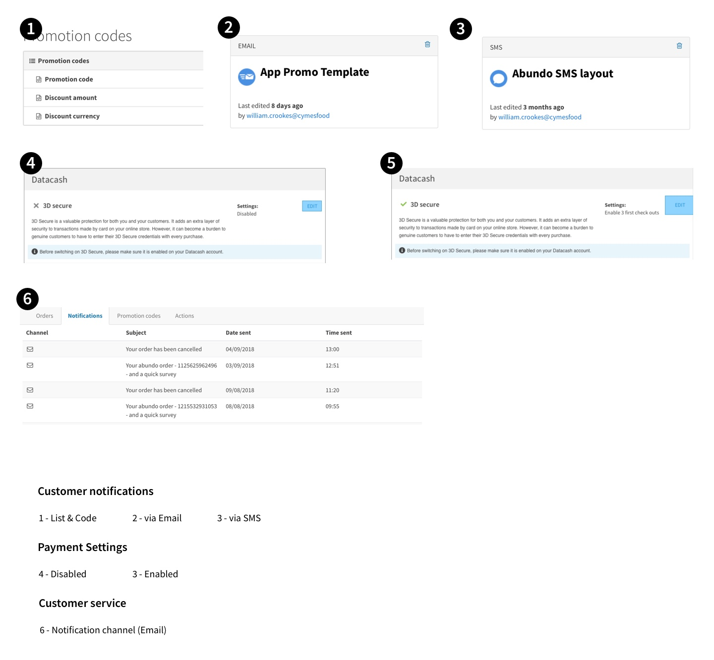
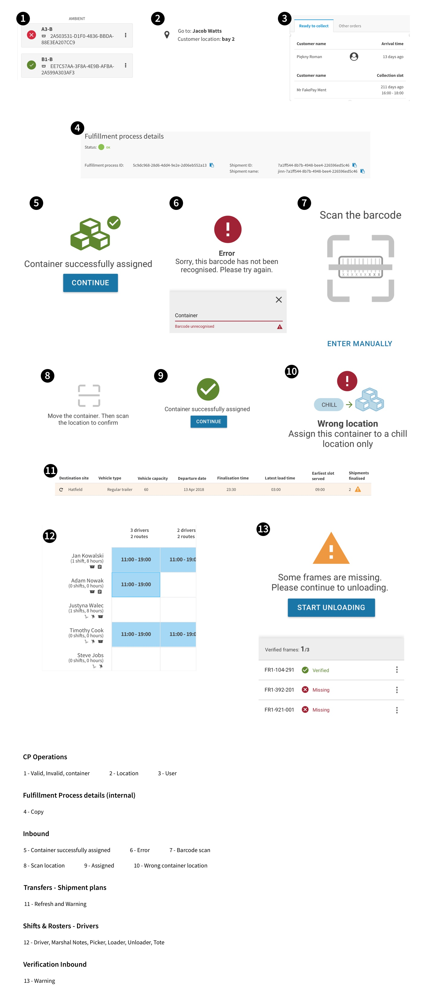
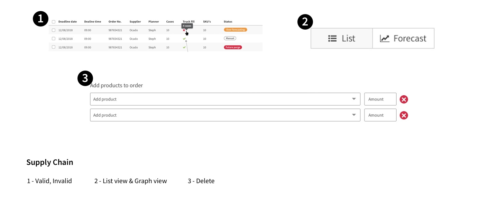
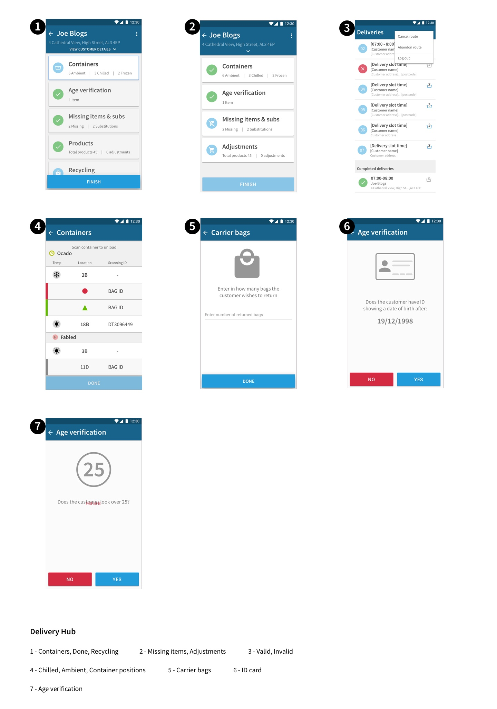

###How designers use icons
So the purpose of this exercise is just to go through some of the designs, spot icons used and try to see if using them its important/relevant or if those icons add value to different panels/screens.

###Questions asked
~~**1.** When do you decide to go for an icon instead of just using words? Any examples?~~
~~**2.** Do you think that the icon next to the label makes any difference in terms of user experience on your design?~~
~~**3.** Looking at  all your designs is there are any icons that you consider obsolete?~~

__Why and where you use icons in your designs?__

<!--more-->

###Darek
__Why?__

Wants to give the user some kind of representation on what they are about to see on the next screen. Always tries several resources (find common patterns all over the internet Behance, Dribble, etc), then looks for a similar one on Fontawesome. Almost never finds a suitable icon to use so has to create his own custom design to fit his needs.

__Where?__

###Justyna
__Why?__

Give emphasis to some information on screen. Also give extra directions to the user - although these are not crucial to use the page they will add value and clarity to it.

__Where?__

###Kaska
__Why?__

Almost no use of icons - Tried to stay faithful to Aeris as much as possible on her first project so didn't want to risk using icons due to lack of guidelines. Also not sure if we are using Fontawesome Pro / Regular / Light.

###Lukasz
__Why?__

When an application is fully responsive or native its really handy the use of icons to save space (eg. Collection Point operations app). On native, tends to use Material Design combined with custom icons (better for development) and more scalable. 
Feels that icons are not always necessary, they can create overload of information. Need some guidelines on when to combine icons with labels.

__Where?__

###Steph
__Why?__

Almost doesn’t use icons. Apart from the common Aeris (Fontawesome) icons the other ones used sparingly (only one screen) and could be replaced with just words complemented with meaningful colours. Icons make little to no difference on overall design and functionality.

__Where?__

###Steve
__Why?__

Uses icons a lot (mix of Fontawesome, Material Design & custom) mostly on native android apps. Feels that the use of icons is important on native apps (especially) due to lack of space to represent certain concepts on different screens.

__Where?__

